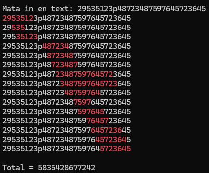

## [Labb 1 – Algoritmer](https://github.com/MelvinEdlund/Labbar/tree/master/Labb1_Algoritmer)
Det här är min första inlämningsuppgift i Programmering med C#, ungefär tre veckor in i kursen. (September 2025)

### Uppgift
- Programmet ber användaren mata in en text i konsolen.  
- Strängen söks igenom efter delsträngar som:  
  - Börjar och slutar på samma siffra.  
  - Bara innehåller siffror (inga bokstäver eller andra tecken).  
  - Start och slutsiffran får inte förekomma någonstans mitt i talet.  
- Varje delsträng som matchar skrivs ut och markeras i färg.  
- Alla hittade tal adderas ihop och totalsumman skrivs ut sist.

  **Exempel på output**  

