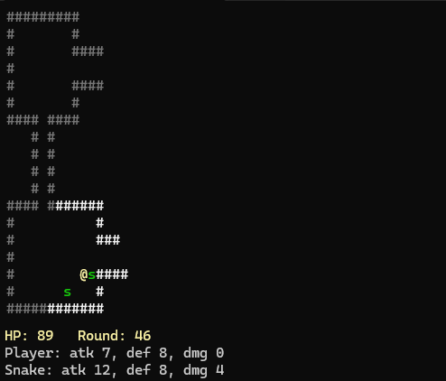
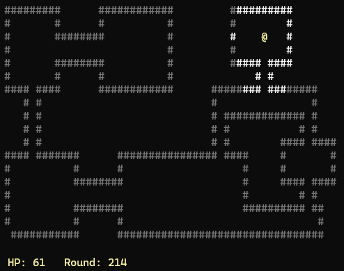
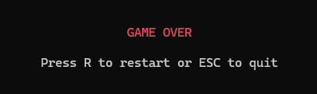

## [Labb 2 – Objektorienterad Programmering](https://github.com/MelvinEdlund/Labbar/tree/master/Labb2_Objektorienterad_Programmering)
Detta är min andra inlämningsuppgift (Oktober 2025).  

### Uppgift
Uppgiften är att skapa en enkel version av dungeon crawler i konsolen där spelaren rör sig i en bana med väggar och fiender.  

## Funktioner
- **Banlayout:** Läser in en fördefinierad bana från en textfil med väggar, spelare och fiender (råttor och ormar).  
- **Klasshierarki:** Använder en abstrakt basklass `LevelElement` med subklasser för väggar och fiender.  
- **Gameloop:** Hanterar spelarens och fiendernas drag i en loop med förflyttning, attacker och strider.  
- **Visionrange:** Spelarens synfält är begränsat till en radie på 5 enheter. Väggar som en gång upptäckts förblir synliga.  
- **Tärningsslag:** Använder tärningsslag för attack och försvar, där spelare och fiender gör skada baserat på resultat.  
- **Rörelsemönster:**  
  - Spelaren styrs av piltangenterna.  
  - Råttor rör sig slumpmässigt.  
  - Ormar försöker fly från spelaren om man kommer för nära.  

## Screenshots
**Mitt i banan – strid med en orm:**  
  

**Slutet av banan – hela kartan synlig:**  
  

**Game Over – när spelaren förlorar:**  
 
