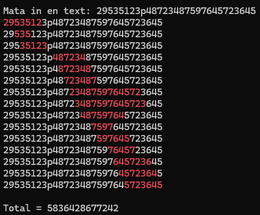
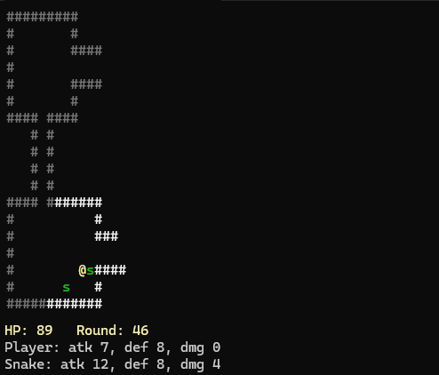
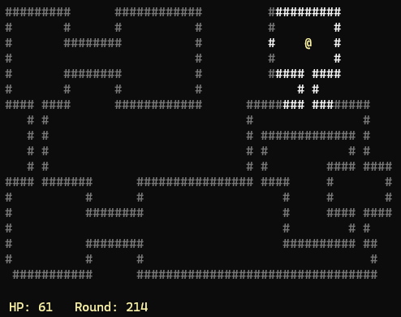
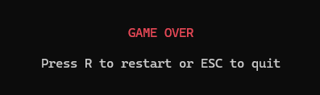

# Labbar till NEU25G

## [Labb 1 – Algoritmer](https://github.com/MelvinEdlund/Labbar/tree/master/Labb1_Algoritmer)
- Programmet ber användaren mata in en text i konsolen.  
- Strängen söks igenom efter delsträngar som:  
  - Börjar och slutar på samma siffra.  
  - Bara innehåller siffror (inga bokstäver eller andra tecken).  
  - Start- och slutsiffran får inte förekomma någonstans mitt i talet.  
- Varje delsträng som matchar skrivs ut och markeras i färg.  
- Alla hittade tal adderas ihop och totalsumman skrivs ut sist.

## [Labb 2 – Objektorienterad Programmering](https://github.com/MelvinEdlund/Labbar/tree/master/Labb2_Objektorienterad_Programmering)
Detta är min andra inlämningsuppgift i mina .NET-studier på IT-Högskolan.  

Projektet är en förenklad version av ett dungeon crawler-spel i konsolen där spelaren rör sig i en bana med väggar och fiender.  

## Funktioner
- **Banlayout:** Läser in en fördefinierad bana från en textfil med väggar, spelare och fiender (råttor och ormar).  
- **Klasshierarki:** Använder en abstrakt basklass `LevelElement` med subklasser för väggar och fiender.  
- **Spelloop:** Hanterar spelarens och fiendernas drag i en loop med förflyttning, attacker och strider.  
- **Sikt:** Spelarens synfält är begränsat till en radie på 5 enheter. Väggar som en gång upptäckts förblir synliga.  
- **Tärningsmekanik:** Använder tärningsslag för attack och försvar, där spelare och fiender gör skada baserat på resultat.  
- **Rörelsemönster:**  
  - Spelaren styrs av inmatning.  
  - Råttor rör sig slumpmässigt.  
  - Ormar försöker fly från spelaren om denne kommer för nära.  

## Screenshots
**Mitt i banan – strid med en orm:**  
  

**Slutet av banan – hela kartan synlig:**  
  

**Game Over – när spelaren förlorar:**  
 

## Syfte
Projektet fokuserar på objektorienterade principer som arv, abstraktion och kodåteranvändning.  
