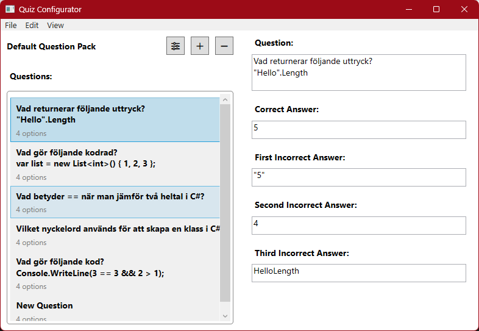
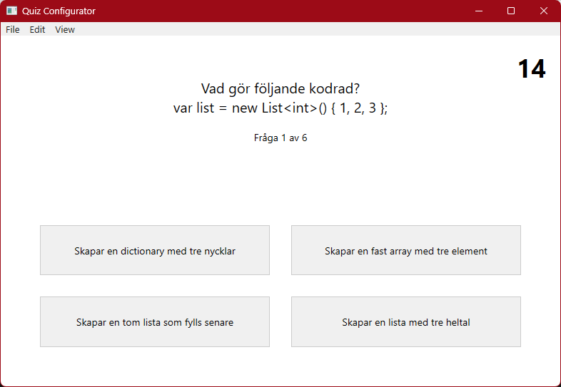
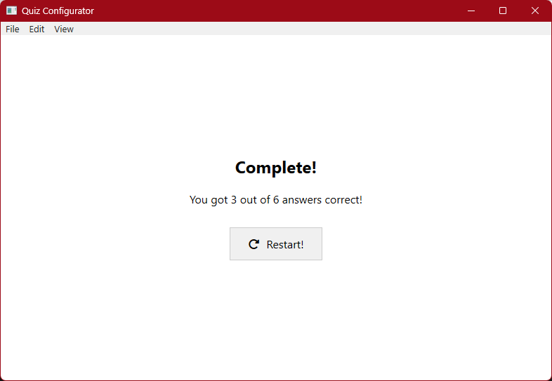
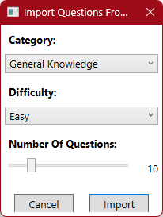
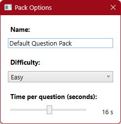

# Labbar till NEU25G

## [Labb 1 – Algoritmer](https://github.com/MelvinEdlund/Labbar/tree/master/Labb1_Algoritmer)
Det här är min första inlämningsuppgift i Programmering med C#, ungefär tre veckor in i kursen. (September 2025)

### Uppgift
- Programmet ber användaren mata in en text i konsolen.  
- Strängen söks igenom efter delsträngar som:  
  - Börjar och slutar på samma siffra.  
  - Bara innehåller siffror (inga bokstäver eller andra tecken).  
  - Start och slutsiffran får inte förekomma någonstans mitt i talet.  
- Varje delsträng som matchar skrivs ut och markeras i färg.  
- Alla hittade tal adderas ihop och totalsumman skrivs ut sist.

  **Exempel på output**  

---

## [Labb 2 – Objektorienterad Programmering](https://github.com/MelvinEdlund/Labbar/tree/master/Labb2_Objektorienterad_Programmering)
Detta är min andra inlämningsuppgift (Oktober 2025).  

### Uppgift
Uppgiften är att skapa en enkel version av dungeon crawler i konsolen där spelaren rör sig i en bana med väggar och fiender.  

## Funktioner
- **Banlayout:** Läser in en fördefinierad bana från en textfil med väggar, spelare och fiender (råttor och ormar).  
- **Klasshierarki:** Använder en abstrakt basklass `LevelElement` med subklasser för väggar och fiender.  
- **Gameloop:** Hanterar spelarens och fiendernas drag i en loop med förflyttning, attacker och strider.  
- **Visionrange:** Spelarens synfält är begränsat till en radie på 5 enheter. Väggar som en gång upptäckts förblir synliga.  
- **Tärningsslag:** Använder tärningsslag för attack och försvar, där spelare och fiender gör skada baserat på resultat.  
- **Rörelsemönster:**  
  - Spelaren styrs av piltangenterna.  
  - Råttor rör sig slumpmässigt.  
  - Ormar försöker fly från spelaren om man kommer för nära.  

## Screenshots
**Mitt i banan – strid med en orm:**  
  

**Slutet av banan – hela kartan synlig:**  
  

**Game Over – när spelaren förlorar:**  
 

---

## [Labb 3 – Quiz Configurator](https://github.com/MelvinEdlund/Labbar/tree/master/Labb3_QuizConfigurator)
Detta är min tredje inlämningsuppgift i Programmering med C#, ungefär två månader in i kursen. (November 2025)

### Uppgift
Programmet är ett WPF-verktyg där användaren kan skapa och redigera frågepaket till ett quiz. Det stödjer import/export av JSON, hämtning av externa frågor via API och är byggt enligt MVVM med DataBinding, Commands och dialogrutor.

### Funktioner
- **Frågehantering:** Skapa, redigera och radera frågor och svar.  
- **Import/Export:** Importera quizpaket från JSON-filer och exportera tillbaka i korrekt struktur.  
- **API-integration:**  
  - Hämtar frågor från ett externt trivia-API (Open Trivia DB eller motsvarande).  
  - API-svaret mappas till interna modeller med DTO-klasser.   
  - Användaren kan förhandsgranska och välja vilka frågor som ska läggas till.  
- **MVVM-struktur:** ViewModels hanterar logik, validering och bindningar till gränssnittet.  

### Screenshots
**Huvudfönster:**  

**Spelfönster:**  

**Importdialog:**  
  

